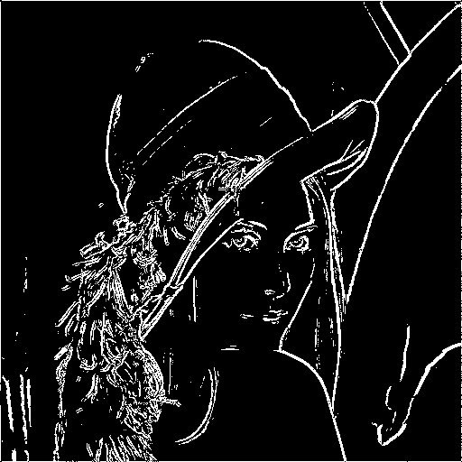

# 图像轮廓提取

实现了一个简单的图像轮廓提取功能，使用C++处理图像数据并使用Python进行图像转换与可视化，其中有关图形可视化的部分均由大模型生成，其余部分均由本人编写。

## 概述

- 通过以下步骤对图像进行处理：
1. 将原始图像转换为二值图
2. 计算图像的梯度（使用Sobel算子）
3. 计算梯度幅值和方向角
4. 提取并可视化图像轮廓
5. 将轮廓叠加到原图中进行展示

## 文件结构

```
cv_homework2/
├── origin_img/       # 存放原始图像
├── result_img/       # 存放结果图像
├── src/
│   ├── extract.h     # 图像处理类定义
│   ├── extract.cpp   # 图像处理类实现
│   ├── main.cpp      # 主程序入口
│   ├── get_img.py    # 图像预处理脚本
│   └── visualize.py  # 结果可视化脚本
└── run.sh            # 自动执行全部流程的脚本
```

## 核心功能

- **图像预处理**：将彩色图像转换为512x512的灰度图像，并进行二值化处理
- **梯度计算**：使用Sobel算子计算图像x方向和y方向的梯度
- **边缘检测**：基于梯度幅值和方向角计算图像边缘
- **结果可视化**：将计算结果转换为可视化图像输出
- **轮廓叠加**：将提取的轮廓叠加到原图上展示

## 使用方法

1. 在`origin_img`目录中放置要处理的图像
2. 运行自动化脚本：
   ```bash
   bash run.sh
   ```
3. 处理后的图像将保存在`result_img`目录中：
   - `*_Outline.png`：单独的轮廓图像
   - `*_Overlay.png`：轮廓叠加到原图的结果


## 运行流程

脚本`run.sh`会自动执行以下步骤：
1. 使用`get_img.py`将原始图像转换为文本格式的图数据
2. 编译并运行C++程序处理图像数据
3. 使用`visualize.py`将处理结果转换回可视化图像
4. 将轮廓叠加到原图并保存结果

## 轮廓展示


## 叠加效果


## 参数调整

- 在`extract.h`中可以修改`T_`和`A_`参数来调整边缘检测的灵敏度
- `T_`是幅值阈值，`A_`是角度阈值
- 默认值：`T_ = 30`，`A_ = π/6`

## 注意事项

- 确保拥有正确的文件执行权限：`chmod +x run.sh`
- 目前处理图像的固定尺寸为512x512像素
- 根据 `extract.h` 中定义的输出规则，修改 `main.cpp` 中的输出类函数和 `run.sh` 的 `output_img` 文件名，
可以看到梯度幅度图、沿水平垂直的梯度图和方向角图（示例中分别为：`lena_Grid.png`, `lena_Gx.png`, `lena_Gy.png`, `lena_Phi_x_y.png`）